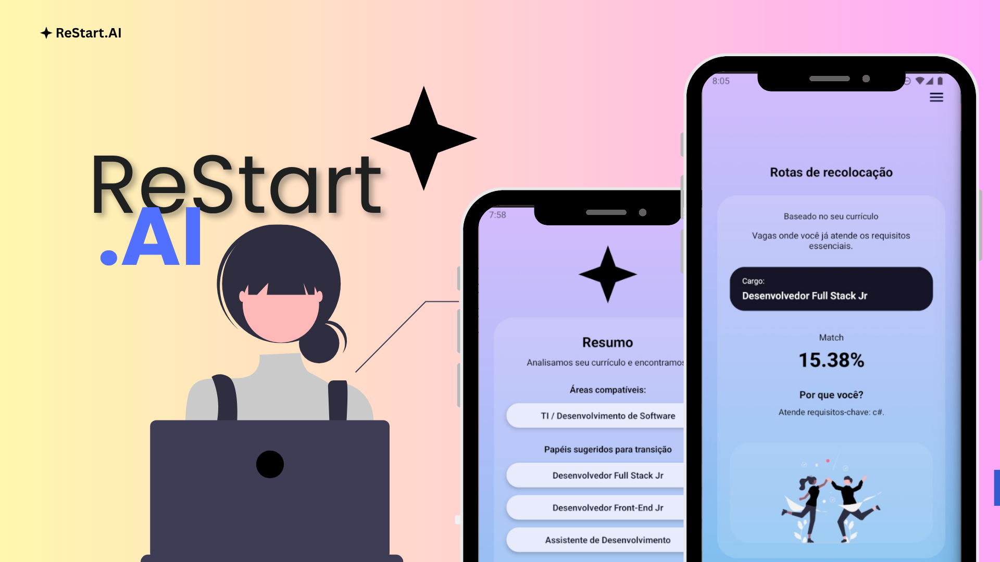
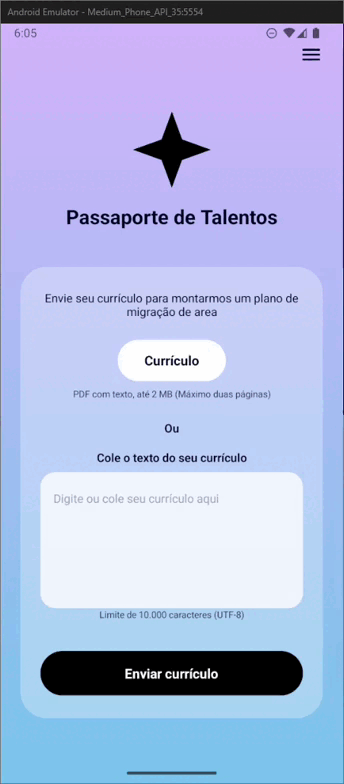

ReStart.AI – Futuro do Trabalho com IA Generativa
==================================================

📌 O que é o ReStart.AI?
------------------------

O **ReStart.AI** é um app mobile que ajuda pessoas em fase de mudança ou recomeço de carreira.

A partir do **currículo do usuário**, o sistema:

1. Identifica as principais **competências**.
2. Sugere **uma única oportunidade-alvo** com maior aderência (“Sua melhor oportunidade”).
3. Mostra:
   - ✅ Um **percentual de match (%)** com esse papel.
   - 💬 Um texto curto de **“por que você?”**, direto e objetivo.

A ideia é ser um **atalho inteligente**:

> currículo → papel-alvo claro → ação focada

---
### 🎥 Vídeo da Solução: <br>

Link: https://youtu.be/X3jqNJHc9zc

---

<p align="center">
  
</p>

🎯 Problema que resolvemos
--------------------------

A IA está transformando o mercado de trabalho muito rápido.  
Muitas funções estão mudando, surgem outras novas, e as pessoas precisam se **requalificar**.

Mesmo com bons currículos, muita gente:

- se perde em vagas genéricas;
- não sabe em qual papel teria **mais chance hoje**;
- gasta tempo tentando de tudo, mas sem foco.

O ReStart.AI entra justamente aqui:

- traduz o histórico do usuário em **um papel-alvo bem definido**;
- mostra um **match percentual**;
- explica de forma simples **por que aquele papel faz sentido**.

---

🏗 Visão geral da arquitetura
-----------------------------

A solução é formada por **3 camadas principais**:

1. **App Mobile (ReStart.AI Mobile)**
   - Interface que o usuário realmente vê e usa.
   - Permite colar/enviar o currículo.
   - Exibe:
     - “Sua melhor oportunidade”
     - % de match
     - “Por que você?”

2. **Backend .NET (ReStartAI.Api)**
   - API em **.NET** que o app mobile consome.
   - Funções principais:
     - Receber os dados do usuário e o currículo.
     - Chamar o serviço de IA (este projeto FastAPI).
     - Tratar respostas e enviar tudo pronto para o mobile.

3. **Serviço de IA / IoT (ESTE repositório – FastAPI)**
   - API em **Python + FastAPI**.
   - Fala diretamente com a **OpenAI** (modelo GPT).
   - Responsável por:
     - Montar o prompt (engenharia de prompt).
     - Chamar o modelo de IA.
     - Interpretar e limpar a resposta.
     - Devolver um JSON estruturado para o backend .NET.

Fluxo simplificado:

[Usuário] → [App Mobile] → [Backend .NET] → [FastAPI IA/IoT] → [OpenAI]
           ←           respostas fluem no caminho inverso           ←

---

<p align="center">
  
</p>

🧠 Papel da IA (neste serviço FastAPI)
--------------------------------------

A IA é usada para:

- Entender o conteúdo do **currículo**.
- Identificar:
  - competências;
  - experiências relevantes;
  - pontos fortes e lacunas.
- Sugerir um **papel-alvo**:
  - Ex.: “Desenvolvedor Backend Júnior”, “Analista de Dados Pleno” etc.
- Gerar:
  - um **match (%)** com esse papel;
  - uma explicação curta “por que você?”;
  - sugestões de próximos passos.

Tudo isso é guiado por **prompts bem definidos** (Prompt Engineering),  
que orientam o modelo a responder em um formato de JSON que o sistema consegue ler.

---

🧬 O que esse repositório contém (FastAPI / IA / IoT)
-----------------------------------------------------

Aqui está o **serviço de IA** usado pelo backend .NET.

Principais responsabilidades:

- Expor endpoints HTTP (REST) com FastAPI.
- Proteger o acesso com uma chave interna (`X-Internal-Key`).
- Orquestrar as chamadas à OpenAI.
- Aplicar:
  - **rate limit** (limite de requisições por usuário);
  - **circuit breaker** (evita flood se a IA estiver falhando);
  - **cache** em memória (evita chamadas repetidas desnecessárias).
- Tratar erros e devolver respostas amigáveis.

### Endpoints principais

- `POST /insight`
  - Gera um **insight completo** para o usuário:
    - melhor oportunidade;
    - match em %;
    - ações sugeridas (aplicar, explorar, estudar);
    - justificativa.
  - Entrada: JSON com dados de perfil e métricas.
  - Saída: JSON estruturado (`InsightResponse`).

- `POST /resume-summary`
  - Gera um **resumo estruturado do currículo**.
  - Saída: principais pontos fortes, gaps e sugestões.

- `GET /healthz`
  - Verifica se o serviço está de pé (liveness).

- `GET /readyz`
  - Verifica se o serviço está pronto para receber tráfego  
    (chave de IA configurada, circuit breaker fechado etc.).

---

🛠 Tecnologias usadas neste serviço
-----------------------------------

- **Linguagem:** Python 3.11  
- **Framework Web:** FastAPI  
- **Servidor:** Uvicorn  
- **Validação de dados:** Pydantic v2 + pydantic-settings  
- **IA:** OpenAI (modelo GPT, ex.: `gpt-4o-mini`)  
- **Containerização:** Docker  

No restante da solução:

- **Backend principal:** .NET Web API  
- **App Mobile:** React Native / Expo  
- **Banco de dados:** (definido e acessado pelo backend .NET)

---

🚀 Como rodar localmente
------------------------

### 1. Clonar o repositório

```bash
git clone https://github.com/GS-ReStart-AI/ReStartAI-IoT.git
cd ReStartAI-IoT
```

### 2. Configurar o arquivo `.env`

Crie um arquivo `.env` na raiz do projeto com, por exemplo:

```env
# Chave da OpenAI (usada via alias RESTARTAI_OPENAI_KEY)
RESTARTAI_OPENAI_KEY=sk-...

# Modelo de IA utilizado
MODEL=gpt-4o-mini

# Chave interna usada pelo backend .NET para chamar este serviço
INTERNAL_KEY=sua-chave-interna-secreta

# Parâmetros de tempo e tokens
OPENAI_TIMEOUT=10
OPENAI_MAX_TOKENS=80
RESUME_MAX_TOKENS=512
OPENAI_TEMPERATURE=0.2
```

> Importante: este serviço lê a chave da OpenAI pela variável `RESTARTAI_OPENAI_KEY`.

### 3. Rodar com Python

```bash
# (opcional) criar ambiente virtual
python -m venv .venv
source .venv/bin/activate  # Windows: .venv\Scripts\activate

pip install --upgrade pip
pip install -r requirements.txt

uvicorn app:app --reload --host 0.0.0.0 --port 8000
```

Acesse:

- API: `http://localhost:8000`
- Documentação Swagger: `http://localhost:8000/docs`

### 4. Rodar com Docker

```bash
docker build -t restartai-iot .
docker run -p 8000:8000 --env-file .env restartai-iot
```

---

🔐 Autenticação entre backend e serviço de IA
---------------------------------------------

Todos os endpoints protegidos exigem o header:

```http
X-Internal-Key: <INTERNAL_KEY>
```
- O backend .NET é configurado com essa mesma chave.
- Se a chave estiver errada ou ausente, a API responde com **401 Unauthorized**.

Isso evita que qualquer pessoa externa chame diretamente o serviço de IA.

---

## 👥 Equipe:

* ⭐️ **Valéria Conceição Dos Santos** — RM: **557177**  
* ⭐️ **Mirela Pinheiro Silva Rodrigues** — RM: **558191**


